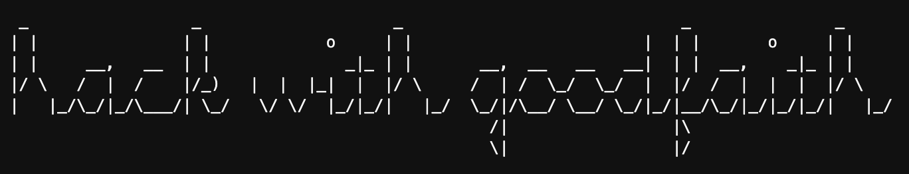
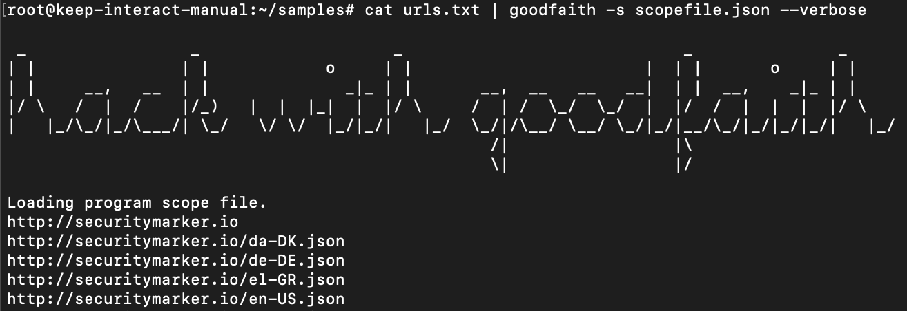
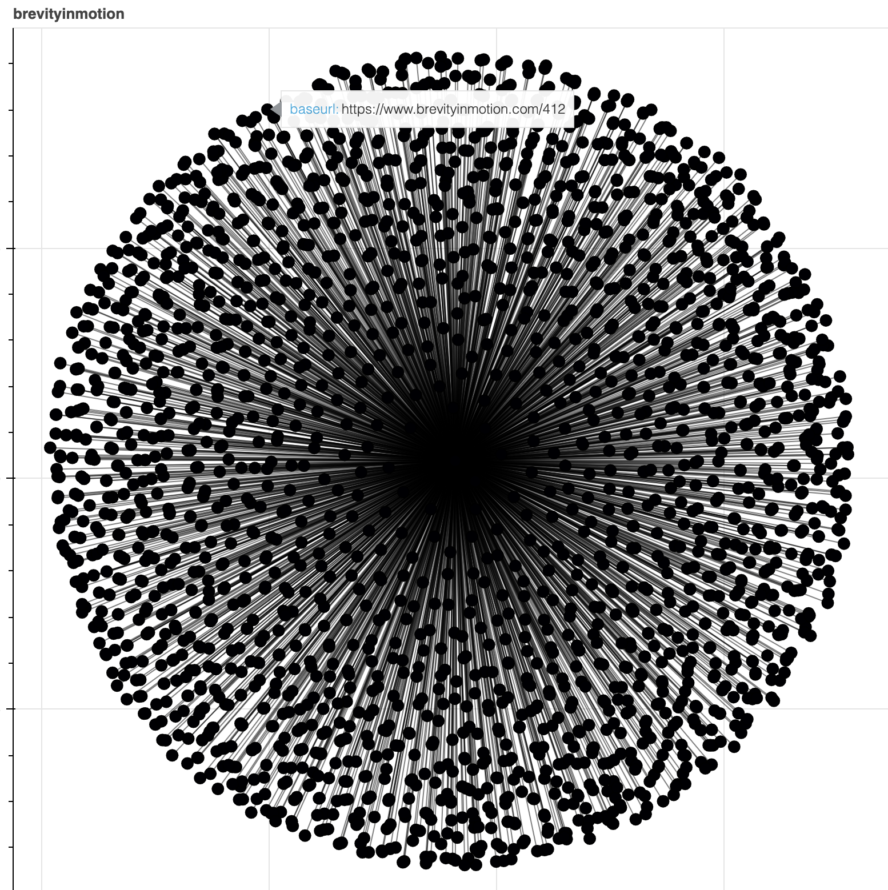
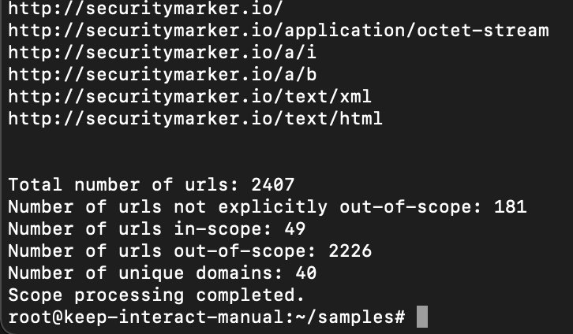

# goodfaith

### Hack within program scope using goodfaith.



## Why goodfaith?
Recon automation continues to increase in popularity. Automation frameworks range anywhere from a complex, scalable cloud environment to a one-liner bash script. Both approaches are powerful, yet the techniques result in massive amounts of output.

What happens next with this output?

One of two things often happen:
1) Manual analysis occurs to identify targets to perform active testing against.
2) Everything discovered from recon and discovery is passed directly to wordlists and scripts.

At this point, the recon data (URL list) may have a combination of recursive sources, archived paths, and URLs pointing to third-party destinations. Prior to active testing such as fuzzing headers, verbs, paths, and parameters, it is important to verify scope.

When performing testing at scale, it is difficult to perform continuous assessment, scaled program analysis, and intelligent scoping without introducing a manual review step between recon and testing.
This is a considerable barrier to both scale and continuous automation when moving from recon to testing. Goodfaith will push the manual analysis further right within the workflow and reduce the steps causing pipeline delays.

There are several public bounty program lists available although not all of them include out-of-scope items. Additionally, the json schemas, naming, and data is not effectively validated for consistency. This adds upfront effort to generate input scope for goodfaith to consume but provides ongoing value upon initial creation.
The usage of goodfaith will help researchers avoid generating traffic against explicitly out-of-scope targets that may result in damage to the company through availability impacts or outages, it could result in researcher program/platform bans, lost bounties, or worst case - legal consequences. To reduce the likelihood of testing against out-of-scope targets, a security researcher can now demonstrate proactive intent to __hack with goodfaith__.

### Features

This tool solves these major barriers towards scalable automation via the following features.
* goodfaith can be imported into an existing project or utilized as a standalone bash script.
* goodfaith can be chained into bug bounty one-liners to maintain scope throughout a workflow.
* goodfaith removes explicitly out-of-scope targets from a workflow.

### Installation

`goodfaith` can be installed using Python Pip with the following command:
```
pip3 install goodfaith
```
### Usage

Example usage with input file:

`goodfaith -s $HOME/goodfaith/samples/scope.json -i $HOME/goodfaith/samples/brevityinmotion-urls-max.txt -o $HOME/goodfaith/output`

Example usage with stdin and bash piping:

`cat urllist.csv | goodfaith -s $HOME/goodfaith/samples/scope.json --quiet | tee scopedurls.txt`

`cat urls.txt | goodfaith -s scopefile.json | httpx`

Example bulk import:

`goodfaith -b bugcrowd -o output`

__Required arguments__:
* __-s, --scope__ : A JSON formatted scope file is required in order to process the urls. This argument requires the path and filename.

Input file format:
```
{
  "program": "brevityinmotion",
  "in_scope": [
    "*.brevityinmotion.com",
    "securitymarker.io",
    "https://www.github.com/brevityinmotion"
  ],
  "out_of_scope": [
    "icicles.io"
  ],
  "platform": "External",
  "invite": "private"
}
```

The JSON scope input file must contain the 'program', 'in_scope', and 'out_of_scope' keys and values. An example file can also be refereced at <https://github.com/brevityinmotion/goodfaith/blob/main/samples/scope.json>.

__Optional arguments__:
* __-h, --help__ : Provides syntax information for usage.
* __-i, --inputfile__ : The location and filename of the URL input file. Only use this argument when not passing URLs as stdin. 
* __-o, --outputdir__ : The location of the output directory. If the folder does not already exist, it will be created. If no output directory is provided, no output files will be generated and the only output will be printed to the console via stdout.
* __-v, --verbose__ : Output additional details to the console (statistics, errors, and progress). This mode should not be used if passing the stdout to another tool and is best utilized for troubleshooting.
* __-q, --quiet__ : Only output the URLs to the console/stdout to support bash piping. This mode already defaults to true if verbose is not set although can be explicitly defined.
* __-b, --bulk__ : Generate bulk scope files for public programs from major platforms. Valid platforms include: [hackerone, bugcrowd, intigriti, yeswehack, federacy, hackenproof]. The data is generated from the amazing bounty targets project (https://github.com/arkadiyt/bounty-targets-data) by Arkadiy Tetelman!

__Experimental arguments__:
* __-g, --graph__ : Output the information into a html graph file to the output directory. This functionality is implemented but needs to be tuned and enhanced. Future intent would be to provide an interactive file to explore and visualize patterns, scope status, and program correlations. It is also currently slow to generate.



__Future arguments__:
* __-c, --config__ : The parameters will be supported in the future via a config file to limit argument inputs.

### Coverage

GitHub URLs are currently removed from in_scope to prevent active enumeration, crawling, and fuzzing against the third-party GitHub sites. Many scopes include GitHub for referencing open source repositories but can be a cause for going out-of-scope when the github.com domain is included in active testing.
 
As URLs are passed through goodfaith, they are categorized based on the following criteria and exported into a series of output files:
- __in_scope__: These are explicitly defined within the in_scope key values.
- __wild__: These are URLs that are discovered from a wildcard * scope. The benefit of separating these are that often, these may be less known and potentially less tested as they require discovery using recon.
- __out_of_scope__: These URLs are explicitly out_of_scope and should be completely avoided from testing and submissions.
- __other__ - These are URLs that are not in_scope but not explicitly out_of_scope. The URLs should be excluded from active testing and fuzzing although may provide clues, insights, or one-hop vulnerabilities from core systems and could potentially provide chaining opportunities with in_scope systems.

__Note__ - when using console mode or bash pipes, __the in_scope and wild URLs are printed to the console/stdout__ to be passed to the next tool.

### Output Files

* {output folder path}/{program}-urls-other.txt - This file includes the urls not explicitly in or out of scope.
* {output folder path}/{program}-urls-in-full.txt - This file includes the full URL for in-scope URLs.
* {output folder path}/{program}-urls-in-base.txt - This file includes the base URL for in-scope URLs. The base path is useful for brute-forcing varying directory paths without the parameters.
* {output folder path}/{program}-urls-out.txt - This file includes the out-of-scope URLs.
* {output folder path}/{program}-details.csv - This csv file includes all of the parsed and scope status data and can be beneficial for further analysis, searching, and filtering.
* {output folder path}/{program}-stats.txt - This file provides an output summary of the processing statistics.
* {output folder path}/{program}-graph.html - This is the graph visualization output which is still in experimental mode.



### Limitations

* Variations of wildcard placement may pose problems and is effective when positioned to the left side of the . of the primary domain (i.e. *.brevityinmotion.com).
* IP address scopes are not currently supported.
* Multiple programs in the same JSON file is not currently supported.
* The base urls in the output files include URLs with extensions as it primarily only removes the parameters at the end.

### Additional Background

The origin of goodfaith was from modularizing code from a larger cloud-based recon automation ecosystem [brevityrecon](https://github.com/brevityinmotion/brevityrecon) so it works very effectively as an import into existing code or projects. The JSON formatting for the program scope integrates effectively with AWS DynamoDB and provides a retrieval method for scalability and storage. Future documentation updates will provide detail for integration into cloud native ecosystems, particularly AWS (Lambda, DynamoDB, and S3).

### Improvements, vulnerabilities, and bugs
As this is an initial release, there are likely issues that need reported. Please open an issue to report or a pull request to resolve.